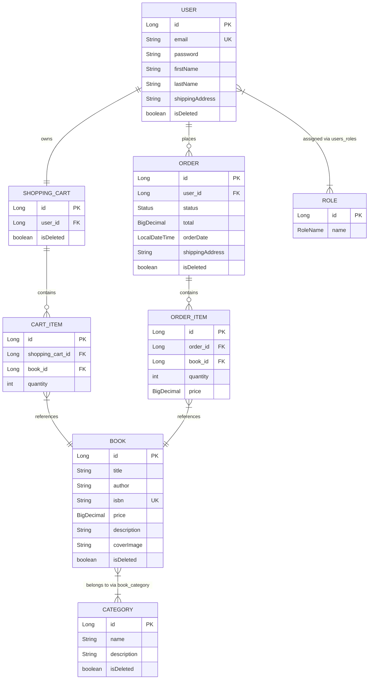

# 📚 Online Book Store API

[](https://www.oracle.com/java/)
[](https://spring.io/projects/spring-boot)

A robust and scalable RESTful API for an Online Book Store, built using the Spring Boot ecosystem. This project
simulates a real-world e-commerce backend where users can browse books, manage their shopping carts,
and administrators can manage the inventory, all protected by secure role-based authentication.

🎬 **[Watch the 3-Minute Project Demo on Loom](<https://www.loom.com/share/73b503c74ec04101bd3771b382d3038f>)**

---

## Key Features

* **User Authentication & Authorization:** Secure registration and login powered by Spring Security and JWT (JSON Web Tokens).
* **Role-Based Access Control (RBAC):** Distinct permissions for `USER` (browse, manage cart, place orders) and `ADMIN` (full CRUD operations on books and categories).
* **Shopping Cart Management:** Dynamic cart updates, adding/removing items, and quantity adjustments.
* **Order Processing:** Seamless checkout flow that converts shopping cart items into formal orders with history tracking.
* **Automated Database Migrations:** Database schema evolution managed via Liquibase.
* **API Documentation:** Interactive and fully documented API endpoints using Swagger UI.

---

## Tech Stack & Tools

* **Backend Framework:** Spring Boot 3.x (Spring Web, Spring Security, Spring Data JPA)
* **Database:** MySQL (Production/Local), H2 (Isolated Integration Testing)
* **Migration Tool:** Liquibase
* **Data Mapping:** MapStruct (for efficient Entity-to-DTO conversions)
* **Security:** JWT (JSON Web Tokens)
* **Testing:** JUnit 5, MockMvc, AssertJ
* **API Docs:** Springdoc-openapi (Swagger UI)
* **Containerization:** Docker & Docker Compose

---

## Domain Model Diagram

The entity-relationship diagram below represents the full relational data model of the application:



---

## API Architecture & Endpoints

The application follows a clean layered architecture (Controller -> Service -> Repository). Below are the primary controllers:

* `AuthenticationController` (`/api/auth/*`) - Public endpoints for user `register` and `login`.
* `BookController` (`/api/books/*`) - Fetching books (Public/User) and modifying inventory (Admin only).
* `CategoryController` (`/api/categories/*`) - Book categorization and filtering.
* `ShoppingCartController` (`/api/cart/*`) - User-specific operations to manage current selections.
* `OrderController` (`/api/orders/*`) - Checkout processing and order history overview.

> 💡 **Interactive Docs:** Once the application is running, you can explore and test all endpoints visually via Swagger UI at: `http://localhost:8080/api/swagger-ui/index.html`

---

## 🔧 Setup & Installation

### Prerequisites
* **Java Development Kit (JDK) 21**
* **Docker & Docker Compose** (required for MySQL; optional if you have a local MySQL server)
* **Maven 3.x** (or use the included `./mvnw` Maven Wrapper — no installation required)

### 1. Clone the Repository
```bash
git clone https://github.com/Alex-Solod/spring_boot_security.git
cd spring_boot_security
```

### 2. Configure Environment Variables
Copy the sample environment file and fill in the values:
```bash
cp .env.sample .env
```
Edit `.env` with your preferred settings (example values shown):
```properties
MYSQLDB_USER=root
MYSQLDB_ROOT_PASSWORD=your_password
MYSQLDB_DATABASE=book_db
MYSQLDB_LOCAL_PORT=3307
MYSQLDB_DOCKER_PORT=3306
SPRING_LOCAL_PORT=8080
SPRING_DOCKER_PORT=8080
DEBUG_PORT=5005
```

> ⚠️ **Default Admin Account** — Liquibase automatically seeds the database with an admin user on first run:
> * Email: `admin@example.com`
> * Password: `admin1234`

---

### Option A: Run via Docker Compose (Recommended)

Starts both MySQL and the Spring Boot application in isolated containers with a single command:

```bash
docker compose --profile deploy up --build
```

To stop all services:
```bash
docker compose --profile deploy down
```

The application will be available at: **`http://localhost:8080/api`**

---

### Option B: Run locally via Maven

**Step 1.** Start only the MySQL database in Docker:
```bash
docker compose up -d mysqldb
```
*(Wait a few seconds for the MySQL healthcheck to pass before proceeding)*

**Step 2.** Set the required datasource environment variables and run the application:

```bash
# macOS / Linux
export SPRING_DATASOURCE_URL="jdbc:mysql://localhost:3307/book_db"
export SPRING_DATASOURCE_USERNAME="root"
export SPRING_DATASOURCE_PASSWORD="your_password"

# Run with Maven Wrapper
./mvnw spring-boot:run
```

**Alternative — build and run the JAR manually:**
```bash
./mvnw clean package -DskipTests
java -jar target/spring_boot_security-*.jar
```

The application will be available at: **`http://localhost:8080/api`**

---

## Testing with Postman

A pre-built Postman Collection is available in the repository: [`postman/book_store_api.postman_collection.json`](postman/book_store_api.postman_collection.json)

### How to import:
1. Open **Postman** → click **Import** → select the file above.
2. The collection uses `{{baseUrl}}` (default: `http://localhost:8080/api`) and `{{token}}` variables.
3. Run **`1. Auth → Login`** — the built-in test script automatically extracts and saves the JWT to `{{token}}`.
4. All subsequent requests in `Books`, `Categories`, `Shopping Cart`, and `Orders` use `{{token}}` automatically via the collection-level Bearer Auth.

### Collection structure:
```
📦 Online Book Store API
 ├── 📂 1. Authentication
 │    ├── Register User           POST /auth/register
 │    └── Login (auto-saves JWT)  POST /auth/login
 ├── 📂 2. Books
 │    ├── Get All Books            GET  /books
 │    ├── Get Book By ID           GET  /books/{id}
 │    ├── Search Books             GET  /books/search
 │    ├── Create Book [ADMIN]      POST /books
 │    ├── Update Book [ADMIN]      PUT  /books/{id}
 │    └── Delete Book [ADMIN]      DELETE /books/{id}
 ├── 📂 3. Categories
 │    ├── Get All Categories       GET  /categories
 │    ├── Get Books by Category    GET  /categories/{id}/books
 │    ├── Create Category [ADMIN]  POST /categories
 │    ├── Update Category [ADMIN]  PUT  /categories/{id}
 │    └── Delete Category [ADMIN]  DELETE /categories/{id}
 ├── 📂 4. Shopping Cart
 │    ├── Get Cart                 GET  /cart
 │    ├── Add Item to Cart         POST /cart
 │    ├── Update Item Quantity     PUT  /cart/cart-items/{id}
 │    └── Remove Item              DELETE /cart/cart-items/{id}
 └── 📂 5. Orders
      ├── Place Order (Checkout)      POST /orders
      ├── Get Order History           GET  /orders
      ├── Get Items by Order ID       GET  /orders/{id}/items
      └── Update Order Status [ADMIN] PATCH /orders/{id}
```
